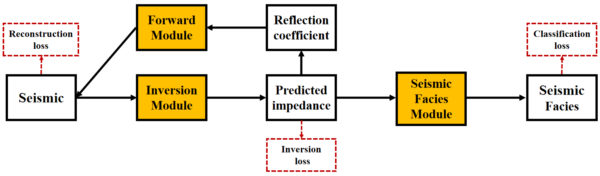

# GPI





### **What is this repository for?**

GPI is a software for paper 《Geophysics-Guided Multi-Stage Hybrid Learning for Post-Stack Seismic Impedance Inversion》.


### Who do I talk to?

Yu Sun； 
a. School of Earth Sciences, Northeast Petroleum University, Daqing 163318, China;
b. National Key Laboratory of Continental Shale Oil, Northeast Petroleum University, Daqing, Heilongjiang 163318, China

E-mail: [191981070190@nepu.edu.cn](mailto:191981070190@nepu.edu.cn;);


### Usage

1、Download the Stanford_VI dataset from the provided link.

​		Stanford_VI: http://scrf.stanford.edu/resources.software.gslib.help.02.php

2、Place the downloaded Impedance data, seismic data and seismic facies data in the data/ directory with the specified names

​		Stanford_VI Impedance label: `data/AI.npy`

​		Stanford_VI  seismic:  `data/synth_40HZ.npy`

​		Stanford_VI weak label: `data/Facies.npy`

3、Use `setting.py` to set the hyperparameters.

4、Train the GPI model using `train_multitask.py`.

5、Test the GPI model using `test_3D.py` to Seismic Impedance Inversion.


### **code introduction**

```
Module introduction：
	1、train_multitask.py test object:
		The GPI model was trained using different datasets.
		
	2、train_sigle.py test object:
		The models for the ablation study and advanced experiments of the GPI model were trained.

	3、test_3D.py
		The trained models were tested using different datasets.

	4、setting.py
		Hyperparameter setting
		
	5、utils/dataset.py
		Obtains the dataset.
		
	6、data:
		Stores the raw dataset.
		data/Stanford_VI/ {AI.npy, Facies.npy, synth_40HZ,npy}
		data: http://scrf.stanford.edu/resources.software.gslib.help.02.php


	7、model:
		Stores the model-related code.
		
	8、save_train_model:
		Stores the trained models.
		
	9、results:
		Stores seismic profiles,Impedance Inversion profiles and seismic facies profiles during the testing process.

SOFT model：           1、VishalNet, 2、GRU_MM, 3、Unet_1D, 4、Unet_1D_convolution
Inversion model：      1、Transformer_cov_para_geo, 2、Transformer+cov_para+geo
Ablation Study model： 1、Tansformer_cov_para, 2、Tansformer_geo, 3、Tansformer_convolution_geo

```


